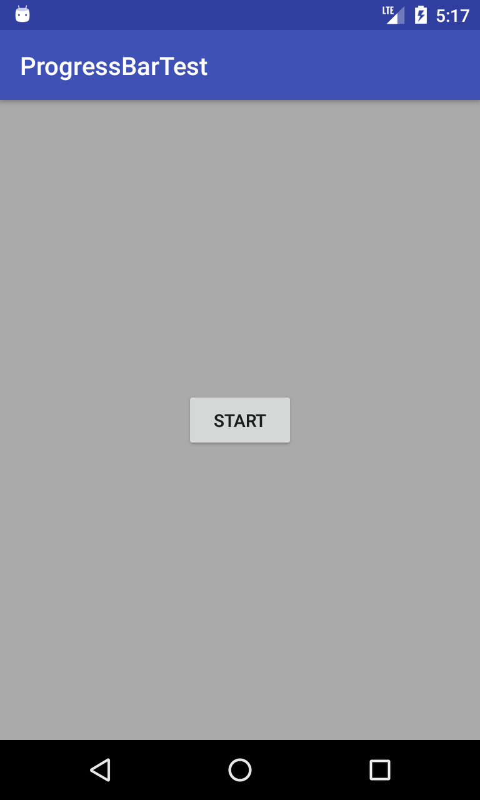
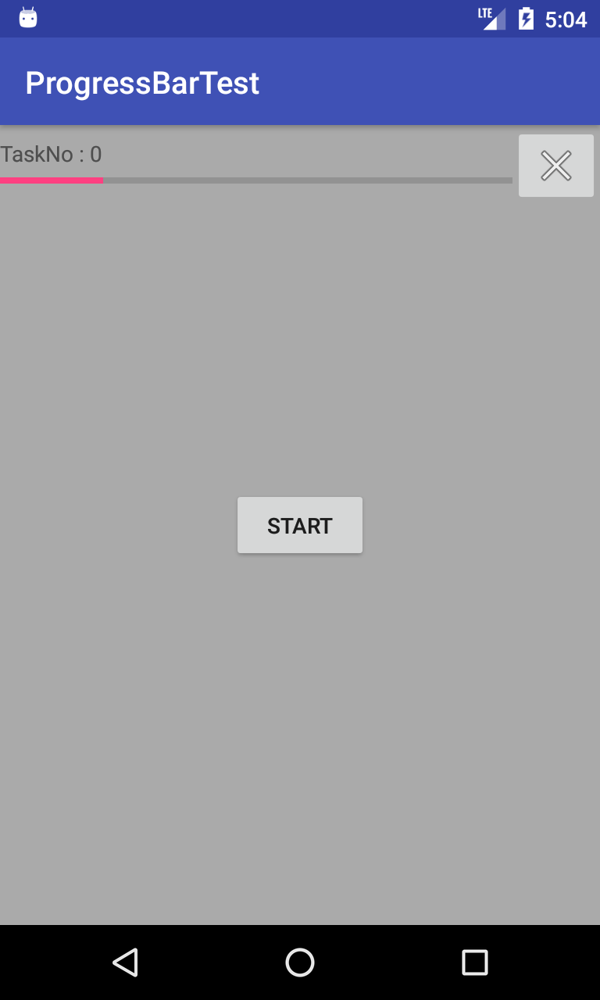
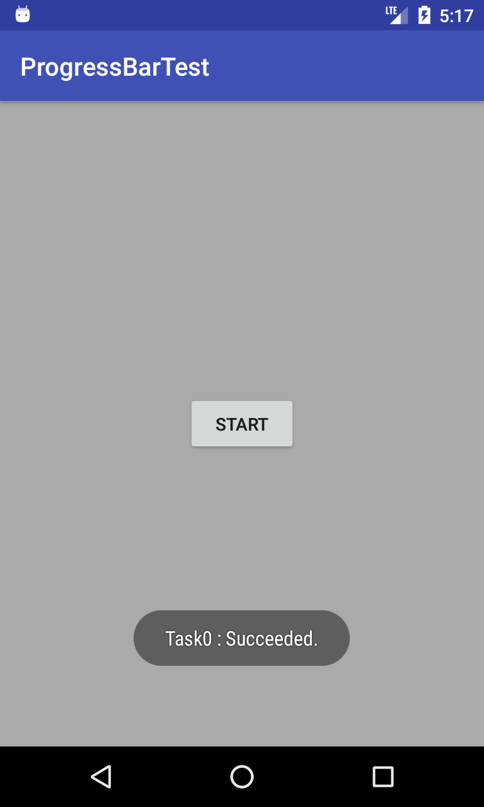

# ProgressBarTest
非同期タスクの進捗表示をする方法のサンプル実装。  
AsyncTaskクラスを用いた非同期タスクの進捗表示は、API level 25 までは、ProgressDialogクラスを用いることで実現できましたが、API level 26 から、ProgressDialogクラスの使用は非推奨となりました。  
AsyncTaskクラスを用いた非同期タスクの進捗表示を、（ProgressDialogクラスではなく）ProgressBarクラスを用いて実現します。  

今回作成した非同期タスクの進捗表示の仕様は以下。  
・AsyncTaskクラスを用いて非同期タスクを実行する。  
・ProgressBarクラスを用いて進捗を表示する。  
・非同期タスクが実行されていないときは、ProgressBar関連コントロール群を表示しない。  
・非同期タスクが実行されているときは、ProgressBarは表示する。  
・非同期タスクが実行されているときは、タスクをキャンセルするボタンを表示する。  
・非同期タスクが実行されているときは、タスク名、進捗率、進捗数を表示する  

## Screenshots : スクリーンショット
  

## Requirements : 必要条件、依存関係
- Android Studio 3.1.2
- Android SDK 26
- Android Support Repository

## Author : 作者
Nobuki HIRAMINE : http://www.hiramine.com

## License : ライセンス
Copyright 2018 Nobuki HIRAMINE  
The source code is licensed under the Apache License, Version 2.0.  
See the [LICENSE](LICENSE) file for more details.  
(本アプリケーションのソースコードのライセンスは、「Apache License, Version 2.0」です。  
詳細は「[LICENSE](LICENSE)」ファイルを参照ください。)
