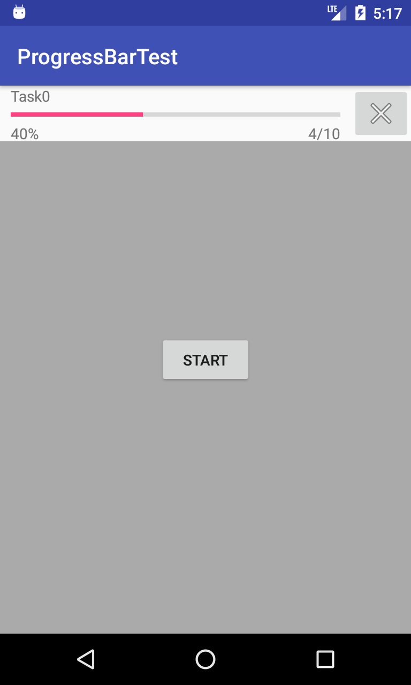

# ProgressBarTest
非同期タスクの進捗表示をする方法のサンプル実装。  
AsyncTaskクラスを用いた非同期タスクの進捗表示は、API level 25 までは、ProgressDialogクラスを用いることで実現できましたが、API level 26 から、ProgressDialogクラスの使用は非推奨となりました。  
AsyncTaskクラスを用いた非同期タスクの進捗表示を、（ProgressDialogクラスではなく）ProgressBarクラスを用いて実現します。  

今回作成した非同期タスクの進捗表示の仕様は以下。  
・AsyncTaskクラスを用いて非同期タスクを実行する。  
・ProgressBarクラスを用いて進捗を表示する。  
・非同期タスクが実行されていないときは、ProgressBar関連コントロール群を表示しない。  
・非同期タスクが実行されているときは、ProgressBarは表示する。  
・非同期タスクが実行されているときは、タスクをキャンセルするボタンを表示する。  
・非同期タスクが実行されているときは、タスク名、進捗率、進捗数を表示する  

## Screenshots : スクリーンショット
  

## Requirements : 必要条件、依存関係
- Android Studio 3.1.2
- Android SDK 26
- Android Support Repository

## Author : 作者
Nobuki HIRAMINE : [http://www.hiramine.com](http://www.hiramine.com)

## License : ライセンス
```
Copyright 2018 Nobuki HIRAMINE

Licensed under the Apache License, Version 2.0 (the "License");
you may not use this file except in compliance with the License.
You may obtain a copy of the License at

    http://www.apache.org/licenses/LICENSE-2.0

Unless required by applicable law or agreed to in writing, software
distributed under the License is distributed on an "AS IS" BASIS,
WITHOUT WARRANTIES OR CONDITIONS OF ANY KIND, either express or implied.
See the License for the specific language governing permissions and
limitations under the License.
```
